# AI Preview

## AI (Imageine)

### Simple Images

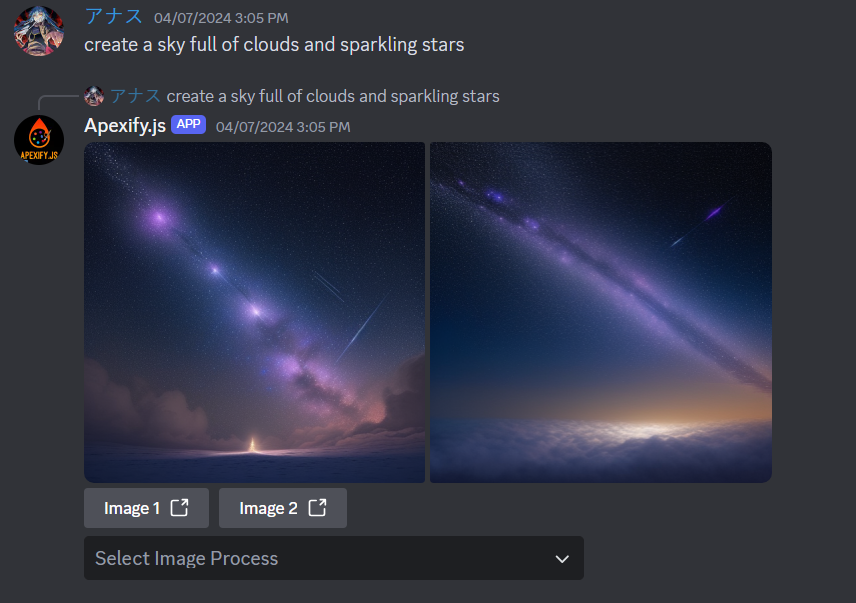

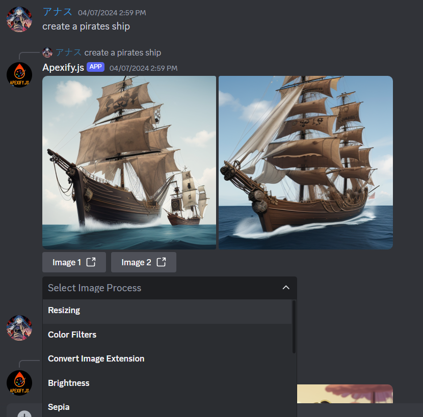

### A More Detailed Image (Clear Images)

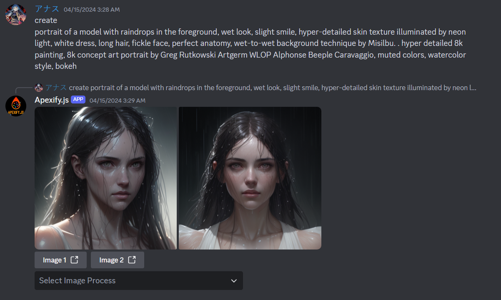

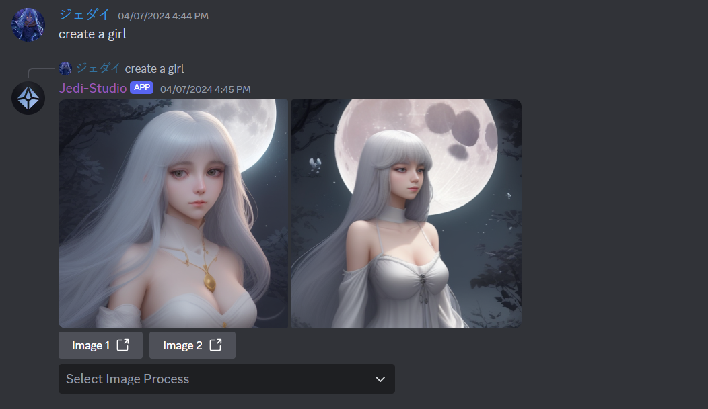

## AI (Attachment Analysis)

### Images

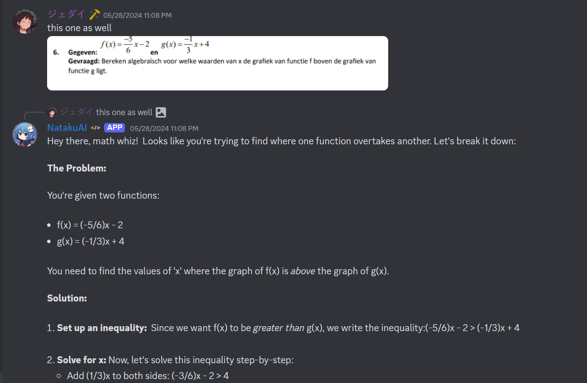

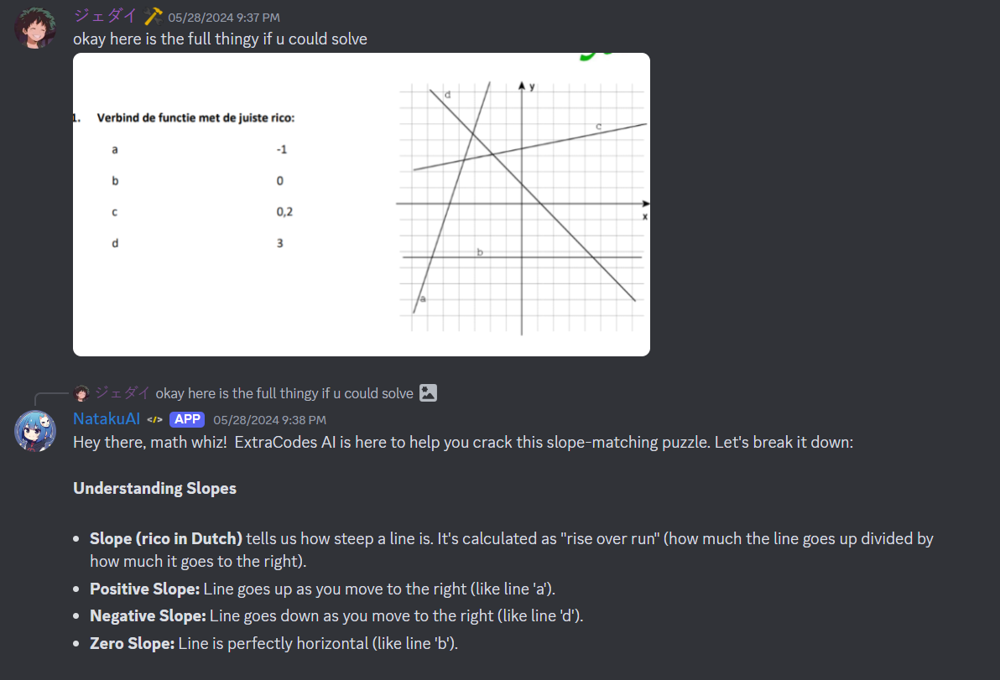

### Files

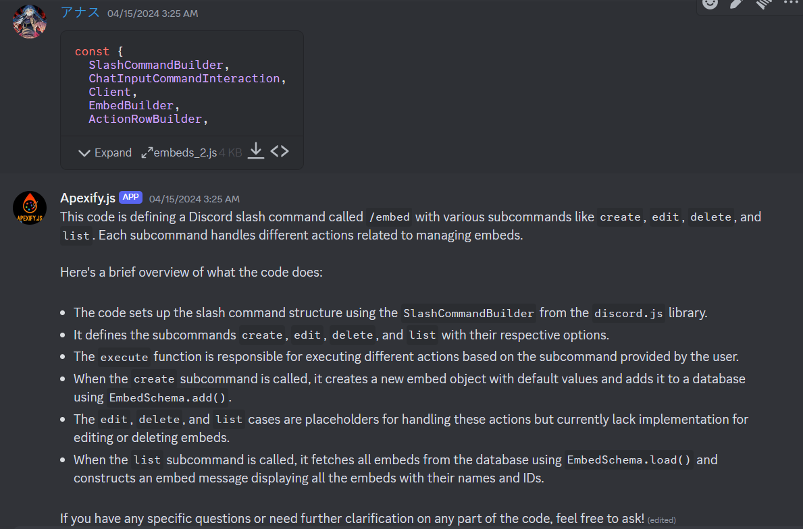

### PDF

## AI (Voice)

### Voice Message (English)

## AI (Normal Chat)

### Chat (English)

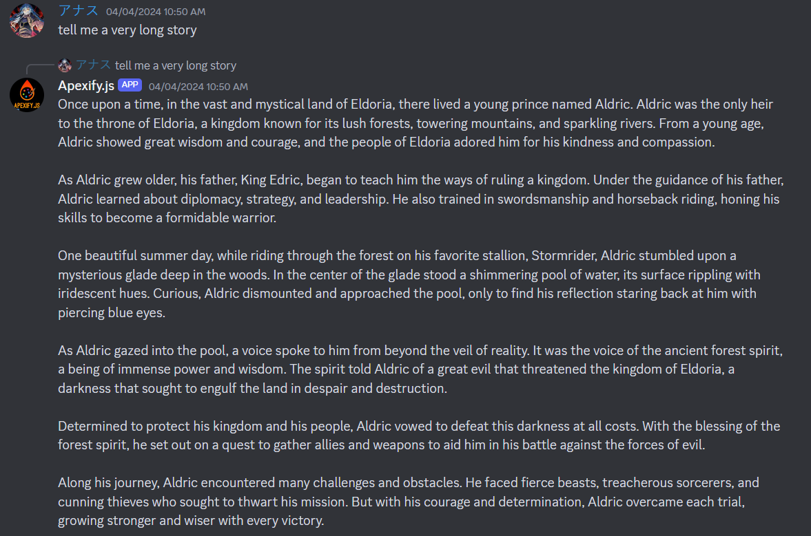

### Chat (Arabic)

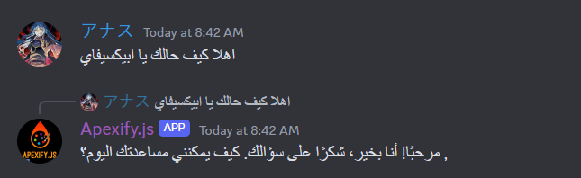

### Chat (Polish)

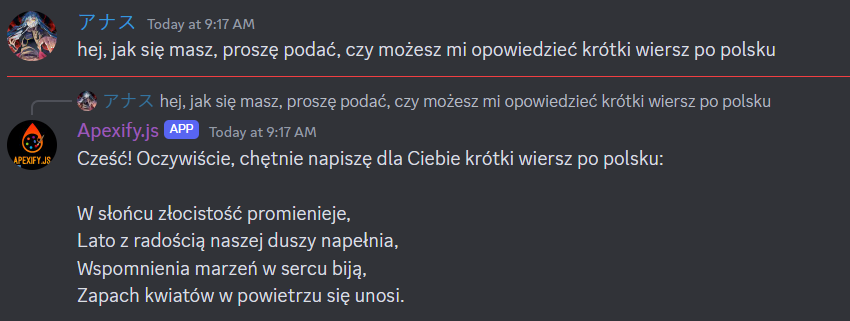

### Chat (Deutch)

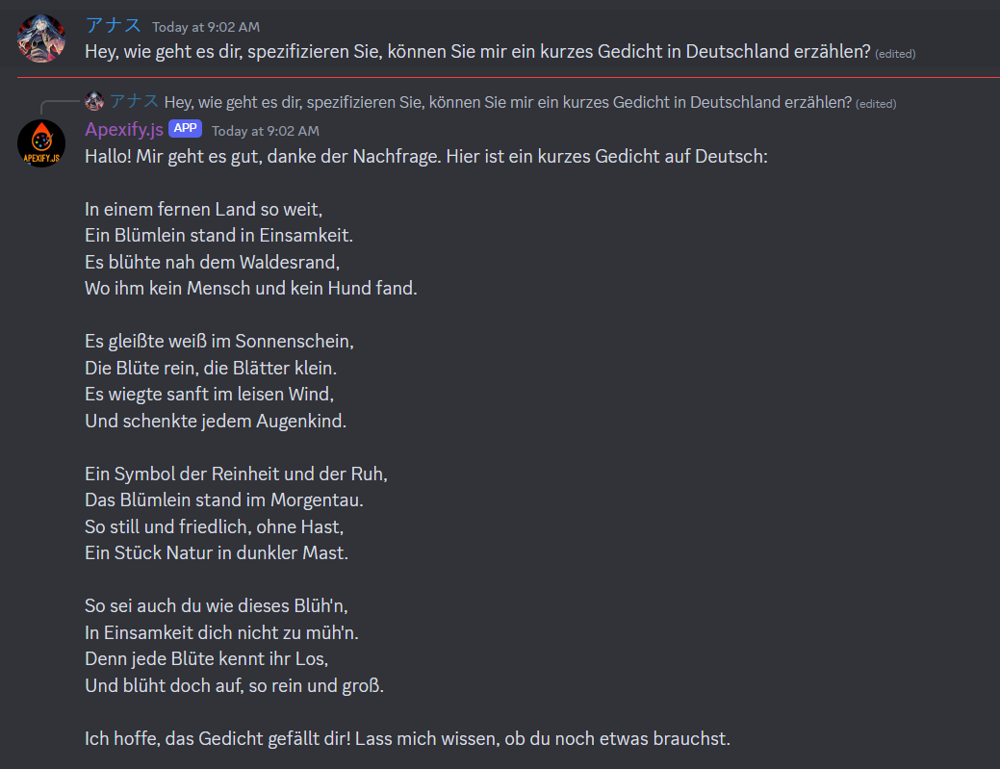

### Chat (French)

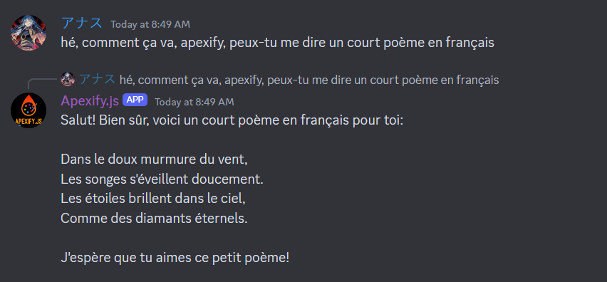
